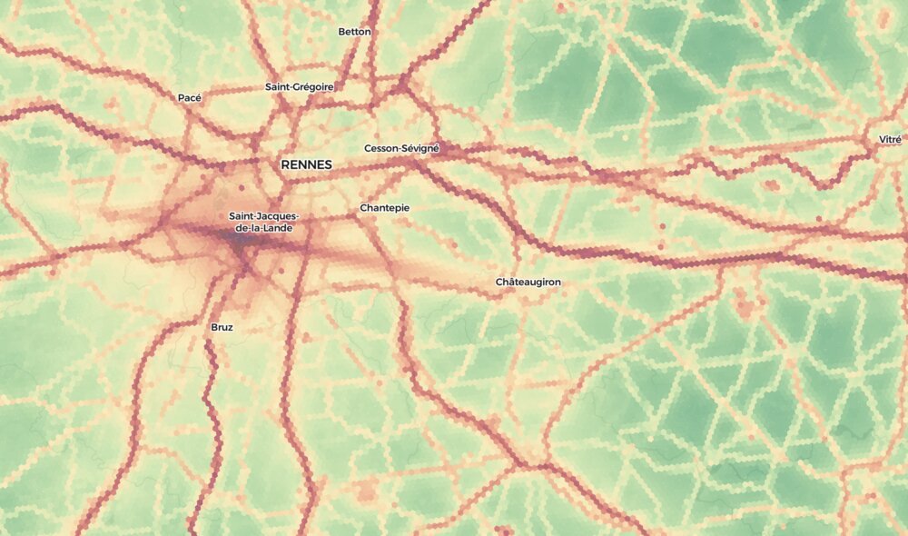

## Mission

Quiet Map shows how loud the world really is — and helps you find the quiet.

1. **Find quiet places** — search any address, explore the map, discover where to live, work, or relax without noise
2. **Understand noise** — see which sources contribute (roads, railways, aircraft, industry) and how terrain, buildings, and forests reduce it
3. **Track change over time** — noise maps updated regularly make noise visible and measurable. By tracking it transparently over time, governments and communities have the data to act — and everyone can see whether things are getting quieter

---

## How the map works

The map computes environmental noise in three steps:

1. **Sources emit noise** — roads, trains, planes, factories, wind turbines, and buildings all produce sound. We model each one using real data: traffic counts, flight tracks, building types, and industrial classifications from OpenStreetMap and national registries.

2. **Sound travels and fades** — noise gets quieter with distance. Hills block it, buildings screen it, forests absorb it. We simulate this physics for every source-receiver pair using ISO 9613-2 propagation with 8 octave bands.

3. **You see the result** — the map shows noise at every 24-meter hexagonal cell, colored from green (quiet, ~10 dB) through yellow and orange to red and purple (very loud, 80+ dB). Each source layer is independent — toggle them to see roads alone, railways alone, or everything combined.



<!-- MAP -->

---

## Five noise layers

Each source is modelled independently — toggle, compare, and explore them in the UI.

### Roads

Road traffic is the dominant source of environmental noise, affecting 60–80% of exposed population in most countries. We model each road segment using the European CNOSSOS-EU standard with 4 vehicle categories (light vehicles, medium trucks, heavy trucks, motorcycles) and compute rolling noise + propulsion noise per octave band.

- **Data:** OpenStreetMap geometry + measured/enriched traffic counts where available; otherwise class-based defaults (see country pages)
- **Key variables:** traffic volume (AADT), vehicle mix (especially heavy vehicle share), speed, road surface
- **Impact:** Doubling traffic = +3 dB. One truck is as loud as ~10 cars. Surface type shifts noise by up to 4 dB.

<details>
<summary>Technical: road emission formula (CNOSSOS-EU Annex II)</summary>

**Standard:** [CNOSSOS-EU Annex II](../standards/cnossos-eu-2021-1226.pdf), 4 vehicle categories per 8 octave bands (63–8000 Hz).

Per vehicle, per band:
```
L_WR,i = A_R,i + B_R,i × log₁₀(v / 70)     [rolling noise]
L_WP,i = A_P,i + B_P,i × (v - 70) / 70      [propulsion noise]
L_W,i  = 10 × log₁₀(10^(L_WR/10) + 10^(L_WP/10))
```

Line source power density:
```
L_W'/m,i = L_W,i + 10 × log₁₀(Q / (1000 × v))
```
where Q = vehicles/hour, v = speed in km/h.

**Vehicle categories:**

| Category | Description | Has rolling noise | Speed cap |
|----------|-------------|-------------------|-----------|
| Cat 1 | Light vehicles (cars, vans ≤3.5t) | Yes | 130 km/h |
| Cat 2 | Medium-heavy (buses, 2-axle trucks) | Yes | 130 km/h |
| Cat 3 | Heavy-duty (3+ axle trucks) | Yes | 80 km/h |
| Cat 4b | Motorcycles >50cc | No (propulsion only) | 130 km/h |

**Road surface corrections** (applied to rolling noise only):

| Surface | Correction |
|---------|-----------|
| Asphalt (reference) | 0 dB |
| Sett / cobblestone | +4 dB |
| Paving stones | +4 dB |
| Concrete | +1 dB |
| Gravel / unpaved | +2 dB |

**Default traffic volumes** (used when no census data available):

| Road class | Total AADT | Light | Medium | Heavy | Moto | Speed | Time split |
|-----------|-----------|-------|--------|-------|------|-------|------------|
| Motorway | 30,000 | 21,600 | 2,400 | 5,700 | 300 | 100 km/h | 65/20/15% |
| Trunk | 15,000 | 11,700 | 1,200 | 1,800 | 300 | 70 km/h | 65/20/15% |
| Primary | 9,000 | 7,470 | 540 | 810 | 180 | 50 km/h | 70/18/12% |
| Secondary | 3,000 | 2,640 | 120 | 180 | 60 | 50 km/h | 70/18/12% |
| Tertiary | 800 | 720 | 26 | 38 | 16 | 50 km/h | 70/18/12% |
| Residential | 500 | 480 | 5 | 10 | 5 | 30 km/h | 70/18/12% |
| Living street | 100 | 98 | 0 | 1 | 1 | 20 km/h | 70/18/12% |

Time split = day (07–19) / evening (19–23) / night (23–07) percentage of daily traffic.

If a segment already has measured or enriched AADT, those counts override the defaults above. The day/evening/night split is still applied as a fixed class-based ratio.

Source height: 0.05 m (CNOSSOS-EU §2.4.1, wheel-road contact).

</details>

### Railways

Rail noise affects fewer people than roads but at higher severity — a single freight corridor can dominate nighttime exposure for kilometres. Freight wagons with cast-iron block brakes are ~10 dB louder than disc-braked passenger stock, making the passenger/freight split critical.

- **Data:** OpenStreetMap rail geometry + precomputed passenger/freight counts where available; otherwise line-type defaults (see country pages)
- **Key variables:** train count per day, passenger vs freight split, speed
- **Impact:** Speed enters as 30×log₁₀ — twice the sensitivity of roads. One freight train at night can outweigh 10 daytime passenger trains in Lden.

<details>
<summary>Technical: railway emission formula (CNOSSOS-EU Annex IV / RMR)</summary>

**Standard:** [CNOSSOS-EU Annex IV](../standards/cnossos-eu-2021-1226.pdf), RMR (Railway Modelling Reference) methodology. Coefficients from [NoiseModelling v5](https://github.com/Universite-Gustave-Eiffel/NoiseModelling).

Per vehicle type, per band:
```
L_roll(f)    = A_rolling(f) + 30 × log₁₀(v / v_ref)   [rolling noise, speed-dependent]
L_traction(f) = A_traction(f)                           [traction noise, constant]
L_total(f)   = 10 × log₁₀(10^(L_roll/10) + 10^(L_traction/10))
L_W'/m(f)    = L_total(f) + 10 × log₁₀(Q / (T_h × 1000 × v))
```
where `Q` = trains **in the period** (after the 65/20/15 split of the daily count),
`T_h` = period hours (12 day / 4 evening / 8 night), `v` = km/h. This is the
CNOSSOS Annex IV / NoiseModelling-compatible line density — per-hour flow,
not per-day total.

**Rail vehicle types:**

| Type | Used for | v_ref | v_max | Brake type |
|------|----------|-------|-------|-----------|
| Passenger | Mainline coaches + electric loco | 100 km/h | 300 km/h | Disc |
| Freight | Block-braked freight wagons | 80 km/h | 120 km/h | Cast iron (loudest) |
| Tram | Urban trams | 50 km/h | 70 km/h | Disc |
| Light rail / DMU | Light rail, narrow gauge (reuses LightRail coefficients) | 80 km/h | 120 km/h | Disc |

High-speed passenger above 200 km/h uses the same rolling spectrum scaled by
`30·log₁₀(v/v_ref)` — not a dedicated aerodynamic model.

**Default train frequencies** (when no line counts are available):

| Line type | Passenger/day | Freight/day | Default speed |
|-----------|--------------|-------------|--------------|
| Main line | 80 | 20 | 80 km/h |
| Branch | 30 | 5 | 80 km/h |
| Industrial siding | 0 | 15 | 80 km/h |
| Rail, unknown usage | 40 | 10 | 80 km/h |
| Tram | 120 | 0 | 40 km/h |
| Light rail | 80 | 0 | 60 km/h |
| Narrow gauge | 10 | 0 | 40 km/h |
| Funicular | 40 | 0 | 20 km/h |

If a line already has passenger/freight counts in the Arrow data, those counts override the defaults above. Day/evening/night is still split by a fixed 65/20/15 ratio, applied identically to passenger and freight.

Finite-line correction: `10 × log₁₀((θ) / π)` where θ = viewing angle from receiver.
Source height: 0.5 m (CNOSSOS-EU §2.7.1, wheel-rail contact).

</details>

### Aircraft

The aircraft layer combines two models: airborne overflights from ADS-B radar trajectories, processed through NPD (Noise-Power-Distance) profiles inspired by ECAC Doc 29, and airport ground operations (runway roll, taxi, apron movement) extracted directly from low-altitude / on-ground ADS-B trajectories with the nearest mapped aerodrome attached for identity. The map shows everything together; the popup splits aircraft into three tabs — ground paths, airborne sub-segments, and cruise hexes.

- **Data:** ADS-B trajectories from [adsb.lol](https://adsb.lol) (full year, all altitudes) + aerodrome polygons from OpenStreetMap (used only to label which airport a ground path belongs to — no snap onto runway / taxi / apron geometry)
- **~124 per-typecode aircraft profiles** auto-generated from EASA ANP v2.3 (Aircraft Noise and Performance database) — covers Boeing 737/747/757/767/777/787, Airbus A319/A320/A321/A330/A340/A350/A380, Embraer E-Jets, ATR, Dash 8, plus light GA and helicopter placeholders for types not in ANP
- **Limitations:** Most modern jets (737 MAX, A320neo, A321neo) have dedicated profiles from EASA ANP v2.3 + supplementary v9 sources; the A220 family and other less-common variants fall back to a similarity-based mapping that picks the closest anchor by engine type and size class. Ground ops show what ADS-B observed — there's no synthetic backfill, so movements outside the receiver coverage simply don't appear. Day/evening/night periods are derived from the segment-midpoint coordinate using an IANA timezone database (DST-aware). This is useful for atlas-scale patterns, not certified airport contouring.

<details>
<summary>Technical: aircraft layer (Doc 29 + airport ground ops)</summary>

**Airborne model inspired by:** [ECAC Doc 29](https://www.ecac-ceac.org/activities/environment/european-aviation-and-environment-working-group-eaeg/airmod) ([Vol 1](../standards/ecac-doc-29-vol1.pdf) · [Vol 2](../standards/ecac-doc-29-vol2.pdf) · [Vol 3](../standards/ecac-doc-29-vol3.pdf)). Not a certified implementation.

Per-segment SEL at receiver:
```
SEL_seg = L_E(d_p) + ΔV + ΔI(φ) - Λ(β,l) + ΔF
```
where:
- `L_E(d_p)` = NPD lookup at slant distance
- `ΔV` = speed correction
- `ΔI(φ)` = engine installation correction
- `Λ(β,l)` = lateral attenuation
- `ΔF` = finite-segment correction

**Sample anchor profiles** (Approach SEL in dB at standard distances 200–25,000 ft, from `engine/noise-compute/src/emission/profiles_generated.rs` — selected examples from the 124-profile generated set):

| Class | Anchor | Approach SEL (200–25000 ft) |
|------|---------|----------------------------|
| Narrowbody jet | B738 | 94.5, 90.4, 87.4, 84.1, 78.7, 72.4, 67.5, 62.3, 54.9, 48.5 |
| Narrowbody jet | A320 | 93.1, 89.1, 86.1, 82.9, 77.7, 71.7, 67.1, 61.9, 55.8, 49.2 |
| Narrowbody jet | A321 | 94.6, 90.2, 86.9, 83.4, 77.7, 71.2, 66.2, 60.5, 54.3, 47.6 |
| Regional jet | CRJ9 | 90.9, 86.7, 83.3, 79.9, 74.1, 67.4, 62.4, 56.9, 50.7, 43.9 |
| Business jet | C56X (Citation) | 87.1, 82.9, 79.8, 76.4, 70.8, 64.3, 59.3, 53.8, 47.6, 41.0 |
| Turboprop | DH8D (Dash 8) | 88.9, 84.4, 81.1, 77.7, 71.9, 65.8, 62.3, 58.7, 55.6, 52.8 |
| Light GA | C172 (Cessna) | 85.0, 80.0, 76.0, 72.0, 65.0, 58.0, 53.0, 47.0, 41.0, 35.0 |
| Helicopter | EC35 | 92.0, 88.0, 85.0, 82.0, 76.0, 70.0, 65.0, 59.0, 53.0, 47.0 |

Auto-generated from EASA ANP v2.3 (+ v9 supplement for modern types). Approach vs departure is inferred from climb/descent rate; unknown typecodes are mapped to the closest anchor by engine type and size class, ultimately to a generic narrowbody fallback for completely exotic codes.

Airport-aware filtering removes obvious off-airport taxi remnants from ADS-B traces, but this is still not a certified airport ground-noise model.

**Airport ground ops:** Low-altitude or on-ground ADS-B segments are grouped per aircraft into contiguous ground paths (one path = one taxi-and-takeoff or land-and-taxi sweep). The path's vertices are the actual ADS-B trajectory; a per-leg `ops_kind` (runway / taxi / apron) is derived from leg speed and length and smoothed to absorb runway-hold pauses. The nearest mapped aerodrome within ~3 km of the path centroid contributes the airport label; paths far from any aerodrome fall into an anonymous strip cluster keyed off the H3 res-7 cell. Each leg is a Section 3 line source with terrain, screening, vegetation and ground attenuation. Energy is normalised across same-kind legs of one path so summing the legs reconstructs one movement's contribution; runway-roll departure picks up Doc 29's +2 dB.

**Popup tabs:** the popup splits aircraft into three tabs — *Ground* (one row per ADS-B ground path), *Airborne* (one row per Stage 2A sub-segment showing single-event SEL), and *Cruise* (one row per crossed H3 res-8 hex with aggregated event-energy across all flights).

**Lden:** Per-period (day 12h, evening 4h +5 dB, night 8h +10 dB), standard [END 2002/49/EC](../standards/end-2002-49-ec.pdf).

</details>

### Industrial and wind turbines

Industrial noise is spatially concentrated but locally dominant — a single cement plant or wind farm can define the noise environment for kilometres. We classify each site by registry NACE sector when available, otherwise by OSM industrial subtype or coarse source type. The range across sectors is ~30 dB: a farm (70 dB) vs a cement plant (100 dB).

- **Data:** OpenStreetMap industrial landuse + NACE codes from national pollution registries (IRZ, E-PRTR, GPPD)
- **Wind turbines:** IEC 61400-11 model, emission based on rated power (98–107 dB Lw)
- **Formula:** `Lw = base_sector + 10 × log₁₀(area / 10,000 m²)` — area capped at 500,000 m²

<details>
<summary>Technical: industrial emission profiles (ISO 8297 + NACE)</summary>

**Standard:** [ISO 8297](https://www.iso.org/standard/15401.html), [CNOSSOS-EU §2.4](../standards/cnossos-eu-2021-1226.pdf).

Reference area: 10,000 m². A 100,000 m² factory emits 10 dB more than its base level.

**By OSM site type:**

| Type | Base Lw | Evening | Night |
|------|---------|---------|-------|
| Generic industrial | 93 dB | -3 | -10 |
| Quarry | 99 dB | -5 | -20 |
| Farmyard | 70 dB | -5 | -20 |
| Works/factory | 94 dB | -3 | -8 |
| Wastewater plant | 89 dB | 0 | 0 (24/7) |

**By NACE sector code** (when enriched with registry data):

| Sector | NACE | Base Lw | Evening | Night |
|--------|------|---------|---------|-------|
| Cement/glass/minerals | 23 | 100 dB | -2 | -4 |
| Metallurgy | 24 | 100 dB | -2 | -4 |
| Mining/quarrying | 08 | 99 dB | -8 | -20 |
| Power generation | 35 | 97 dB | -1 | -2 |
| Waste/recycling | 38 | 95 dB | -3 | -8 |
| Chemical industry | 20 | 94 dB | -2 | -4 |
| Metal fabrication | 25 | 93 dB | -5 | -10 |
| Motor vehicles | 29/30 | 93 dB | -5 | -12 |
| Wood/paper | 16/17 | 93 dB | -5 | -15 |
| Food/beverage | 10/11 | 90 dB | -5 | -12 |
| Electrical/mechanical | 27/28 | 90 dB | -5 | -12 |
| Rubber/plastics | 22 | 90 dB | -5 | -10 |
| Textiles/leather | 13-15 | 88 dB | -5 | -15 |
| Wastewater | 37 | 89 dB | 0 | 0 |
| Warehousing | 52 | 86 dB | -3 | -8 |
| Retail/logistics | 46/47 | 84 dB | -8 | -20 |
| Agriculture | 1-3 | 70 dB | -5 | -20 |

Calibrated against Czech SHM 2022 + [EU Directive 2000/14/EC](https://eur-lex.europa.eu/eli/dir/2000/14/oj/eng) equipment limits, [3M Noise Navigator](https://multimedia.3m.com/mws/media/888553O/noise-navigator-sound-level-hearing-protection-database.pdf) measurements.

Profile priority: registry `nace_4digit` when available, otherwise OSM subtype, otherwise coarse source type. Area comes from stored polygon area when available, otherwise a fallback estimate.

Source height: 8 m (quarry), 10 m (heavy industry NACE 8/23/24/35), 5 m (other industrial), hub height (wind turbines, default 80 m).

**Wind turbine Lw by rated power** (IEC 61400-11):

| Rated power | Lw |
|-------------|-----|
| < 1 MW | 98 dB |
| 1–2 MW | 101 dB |
| 2–3 MW | 103 dB |
| 3–5 MW | 105 dB |
| ≥ 5 MW | 107 dB |
| Unknown (0 kW) | 103 dB (default 2 MW) |

</details>

### Buildings and settlements

Noise from everyday building activity — HVAC systems, human activity, deliveries, playgrounds. Each building is an individual noise source classified by its OpenStreetMap type. This is a custom model — not a CNOSSOS-EU standard source.

- **Data:** OpenStreetMap building polygons with type, height, floors, area
- **Model:** Two-component Lw: fixed sources (HVAC, loading dock) + distributed sources scaling with gross floor area
- **Formula:** `Lw = 10 × log₁₀(10^(Lw_fixed/10) + GFA × 10^(Lw_per_m²/10))` where GFA = footprint × floors

<details>
<summary>Technical: building emission profiles</summary>

10 building types classified from OSM tags (`building=*`, `amenity=*`, `shop=*`):

| Type | OSM tags | Lw fixed | Lw/m² | Evening | Night |
|------|----------|----------|-------|---------|-------|
| Residential | apartments, house, detached | 45 dB | 15 | -5 | -15 |
| Commercial | commercial, retail, shop | 55 dB | 20 | -3 | -20 |
| Warehouse | warehouse, industrial building | 40 dB | 15 | -5 | -15 |
| School | school, kindergarten | 60 dB | 22 | -10 | -25 |
| Hospital | hospital, clinic | 50 dB | 18 | -3 | -5 |
| Church | church, chapel | 50 dB | 20 | -5 | -20 |
| Hotel | hotel, hostel | 48 dB | 16 | -2 | -10 |
| Garage | garage, parking | 35 dB | 12 | -5 | -15 |
| Farm | farm, barn | 40 dB | 14 | -5 | -20 |
| Public | civic, office, government | 52 dB | 18 | -8 | -20 |

Industrial/warehouse buildings within industrial landuse polygons are handled by the industrial pipeline — not double-counted.

Source height: building height / 2 (mid-facade). Propagation: ISO 9613-2 point source (spherical divergence).

Sources: [EU Reg 626/2011](https://eur-lex.europa.eu/eli/reg_del/2011/626/oj/eng) (residential AC units 58–67 dB Lw), [ASHRAE Handbook Ch.48](https://www.ashrae.org/) (HVAC Lw vs capacity), [BS 4142:2014](https://www.bsi-global.com/) (commercial noise assessment).

</details>

---

## How sound travels

Sound gets quieter as it travels. On flat open ground, a road drops about 3 dB every time you double your distance. But the real world has hills, buildings, and forests that block sound further — and hard surfaces like asphalt that reflect it.

We simulate these effects for every source-receiver pair using [ISO 9613-2](https://www.iso.org/standard/74047.html) ([PDF](../standards/iso-9613-2-2024.pdf)) and [CNOSSOS-EU](https://eur-lex.europa.eu/eli/dir_del/2021/1226) ([PDF](../standards/cnossos-eu-2021-1226.pdf)), computed per 8 octave bands (63–8000 Hz), then A-weighted.

Road, railway, industrial, settlement, and aircraft ground ops use the same propagation engine. Airborne aircraft uses NPD tables where atmospheric absorption is already included.

| Effect | What it does | Data source | Max effect | Toggleable |
|--------|-------------|-------------|-----------|-----------|
| Distance | Sound spreads out — 3 dB per doubling (line), 6 dB (point) | Geometry | Baseline | No |
| Atmosphere | Air absorbs high frequencies over long distances | ISO 9613-1 (15°C, 70% RH) | Baseline | No |
| Ground | Soft ground (grass) absorbs; hard ground (asphalt) reflects | Copernicus IMD raster → G-factor | ~3 dB | No |
| Terrain | Hills block sound via diffraction | Copernicus GLO-30 DEM (30m) | 20–25 dB | Yes |
| Buildings | Buildings screen sound like walls | Overture building-height raster (30m) | 20 dB/band | Yes |
| Vegetation | Forests absorb sound, especially high frequencies | ESA WorldCover 2021 | 2–12 dB/band | Yes |
| Reflections | Urban canyons bounce sound, increasing levels | Building enclosure heuristic | +5 dB | With screening |
| Weather | Downwind/inversion conditions can carry sound further | Not currently modelled | — | No |

**Key rule:** When a barrier (hill or building) is present, it replaces the ground effect — you get the larger of the two, not both (ISO 9613-2 §7.3.1). Vegetation attenuation is always additive.

<details>
<summary>Technical: propagation formulas</summary>

**Total received level per band:**
```
L_received,i = L_emission,i - A_div,i - A_atm,i - max(A_ground,i, A_terrain,i + A_screen,i) - A_veg,i + A_refl + FLC
```

**Geometric divergence:**
- Line source (road, rail): `A_div = 10 × log₁₀(2π × d_slant)`
- Point source (industrial, building): `A_div = 20 × log₁₀(d_slant) + 11`

**Atmospheric absorption** (ISO 9613-1, standard atmosphere 15°C, 70% RH):

| 63 Hz | 125 Hz | 250 Hz | 500 Hz | 1 kHz | 2 kHz | 4 kHz | 8 kHz |
|-------|--------|--------|--------|-------|-------|-------|-------|
| 0.1 | 0.4 | 1.0 | 1.9 | 3.7 | 8.7 | 22.0 | 58.4 dB/km |

**A-weighting:** `[-26.2, -16.1, -8.6, -3.2, 0.0, 1.2, 1.0, -1.1]` dB (IEC 61672-1)

</details>

<details>
<summary>Technical: combined terrain + building + barrier diffraction (ISO 9613-2 §7.3 / 7.4 + CNOSSOS-EU §2.5.6)</summary>

DEM, building heights and explicit noise barriers are merged into a single composite top-profile (`elevation + max(building_h, barrier_h)`) sampled along the source→receiver line. Diffraction is computed once over this composite, so a building sitting on a hill can no longer double-count Fresnel attenuation. Explicit roadside noise barriers compete with raster buildings as candidate edges. Source heights: road 0.05 m, rail 0.5 m, point sources at structure height. Receiver height: 4.0 m.

Single diffraction:
```
δ = path_via_edge − direct_path
A_bar = min(20, 10 × log₁₀(3 + 20 × δ × f / 340))   [per frequency]
```

Double / triple diffraction (CNOSSOS C″ for thick barriers):
```
C₃ = (1 + (5λ/e)²) / (1/3 + (5λ/e)²)
A_bar = min(25, 10 × log₁₀(3 + C₃ × 20 × δ × f / 340))
```

The popup splits the combined attenuation back into `terrain` (bare-earth diffraction) and `screening` (combined − terrain) for the impact-breakdown UI, but the underlying physics computes them together. Building reflections (ISO 9613-2 §7.5) are added separately as a 0-5 dB boost from local enclosure around the receiver.

</details>

<details>
<summary>Technical: vegetation attenuation (ISO 9613-2 A.2.2, Central Europe calibration)</summary>

Forest depth measured by sampling WorldCover forest layer along propagation path.

Per-band attenuation rates and caps:

| | 63 Hz | 125 Hz | 250 Hz | 500 Hz | 1 kHz | 2 kHz | 4 kHz | 8 kHz |
|--|-------|--------|--------|--------|-------|-------|-------|-------|
| dB/m | 0.01 | 0.015 | 0.02 | 0.025 | 0.03 | 0.04 | 0.045 | 0.06 |
| Max | 2 dB | 3 dB | 4 dB | 5 dB | 6 dB | 8 dB | 9 dB | 12 dB |

Example: 100m of forest → 1 dB at 63 Hz, 3 dB at 1 kHz, 6 dB at 8 kHz.

Values are half of ISO 9613-2 A.2.2 defaults, calibrated for average Central European mixed forest canopy density (~50%). The binary WorldCover forest raster applies uniform attenuation to any pixel with ≥ 10% tree cover; the scalar compensates for over-application in sparse or partially-covered areas. Future continuous-density approach planned in `docs/future-plans/forest-continuous-density.md`.

</details>

<details>
<summary>Technical: ground effect (CNOSSOS-EU §2.5.15)</summary>

G-factor from Copernicus IMD raster: `G = 1 - IMD/100`. G = 0 (hard: asphalt, water) to G = 1 (soft: grass, forest).

Per-band correction factors: `[-1.5, -0.7, 1.5, 2.5, 2.0, 1.3, 0.7, 0.2]` × G

Soft ground absorbs 2–5 dB at mid-frequencies. Hard ground can add 1–2 dB constructive interference at low frequencies.

</details>

<details>
<summary>Technical: favourable conditions (CNOSSOS-EU §2.5.21)</summary>

Favourable-propagation weather correction is not currently applied. The code keeps a `P_FAV = 0.5` placeholder, but no wind / inversion boost is added to map levels.

</details>

---

## What you see on the map

### The noise indicator: Lden

The map shows **Lden** (day-evening-night level), the European standard from [END 2002/49/EC](https://eur-lex.europa.eu/eli/dir/2002/49/oj/eng) ([PDF](../standards/end-2002-49-ec.pdf)). It weights evening noise +5 dB and night noise +10 dB to reflect the greater annoyance of noise during rest periods:

```
Lden = 10 × log₁₀((12 × 10^(Ld/10) + 4 × 10^((Le+5)/10) + 8 × 10^((Ln+10)/10)) / 24)
```

Day: 07:00–19:00, evening: 19:00–23:00, night: 23:00–07:00.

[WHO 2018 guidelines](https://www.who.int/europe/publications/i/item/9789289053563) recommend: road < 53 dB, rail < 54 dB, aircraft < 45 dB Lden.

### Grid

[H3](https://h3geo.org/) hexagonal grid, resolution 11 (24 m edge-to-edge) — fine enough to distinguish the street-facing vs garden side of a building. Lower resolutions (res 10–6) at lower zoom levels.

### Color scale

Green (quiet, ~10 dB) → yellow (~45 dB) → orange (~55 dB) → red (~65 dB) → dark purple (very loud, 80+ dB). Transparent where there is no computed noise.

### Toggles

- **Source layers:** Roads, Railways, Aircraft, Buildings, Industrial — each toggleable independently
- **Propagation effects:** Terrain, Screening (buildings + reflections), Vegetation — toggle off to see noise without that attenuation on layers that expose propagation adjustments; aircraft popup still breaks out airport ground ops separately
- **Overlays:** Quiet zones (areas below a threshold), Properties (real estate filtered by noise)

---

## Overlays

### Real estate

The map can display real estate listings filtered by noise level. Each country has its own data sources — see individual country pages.

- Properties geocoded to H3 hex cells and joined with noise data
- Default filter: show only properties below 45 dB Lden (WHO outdoor guideline)
- Focus: land plots — building plots, forests, meadows, gardens

### Quiet zones

Highlights contiguous areas below a configurable noise threshold (default 35 dB). Useful for identifying quiet retreats, parks, and areas suitable for noise-sensitive development.

---

## What we measure

Human-made noise is not the same as natural sound. A forest at 50 dB with birdsong feels quiet. A road at 50 dB with traffic feels loud. Quiet Map measures environmental noise from human sources — transport, industry, and urban activity — not nature.

---

## Simplifications

This model is an engineering approximation for a continental-scale noise atlas — not a certified implementation of CNOSSOS-EU or ISO 9613-2.

| Area | Standard says | We do | Impact |
|------|-------------|-------|--------|
| Source height (roads) | CNOSSOS-EU: 0.05 m (rolling) / 0.30 m (propulsion) | 0.05 m for both | Minor — propulsion height difference negligible at atlas scale |
| Terrain profile | Professional SW: 5–10 m spacing | Adaptive 30 m spacing (8–50 points) | May miss narrow barriers (<30 m wide) |
| Aircraft type mapping | Doc 29 / ANP: aircraft-specific certified profiles + procedural steps + weights | ~124 per-ICAO-typecode NPD profiles auto-generated from EASA ANP v2.3 (+ v9 supplement), bucketed at 14 aircraft noise classes for aggregation | ±1-2 dB for ANP-mapped types; similarity_fallback for unmapped typecodes routes to closest anchor by engine/size class |
| Aircraft timing | Airport-local time and operational preprocessing | Segment midpoint → IANA timezone (tzf-rs) → DST-aware local time (chrono-tz); END default period boundaries | Global local time; only airport-local operational-preprocessing differences remain |
| Aircraft ground preprocessing | Curated airport trajectory cleaning | Airport-aware ADS-B filtering removes obvious stale ground segments | Near-runway bias still possible |
| Aircraft ground operations | Surface movement inventories and airport-local operational data | Raw ADS-B trajectories per aircraft × contiguous ground run; nearest-aerodrome identity from OSM polygons; speed/length-based per-leg `ops_kind` with smoothing | Near-runway levels depend on ADS-B surface coverage; movements outside the ADS-B receiver footprint don't appear (no synth-fill in v10) |
| Receiver grid | END: facade receivers (4 m height, 2 m from wall) | H3 res-11 hex centers (24 m edge, 4 m height) | Area average, not per-facade |
| Road corrections | CNOSSOS-EU: gradient, intersection, temperature | Not implemented | ±1–3 dB on steep/cold roads |
| Building reflections | ISO 9613-2 §7.5: image-source ray tracing | Simplified: local enclosure heuristic, 0–5 dB boost | May underestimate in complex geometries |
| Settlement noise | Not standardised (END covers road/rail/aircraft/industry only) | Custom per-building model, 10 OSM building types | Novel — no standard reference values |
| Atmospheric conditions | Variable: temperature, humidity, wind speed | Fixed: 15°C, 70% RH; favourable-weather boost not applied | Seasonal/hourly variation not captured |

Despite these simplifications, the model achieves MAE < 3 dB against national strategic noise maps for road noise (see country validation pages). Aircraft noise has not yet been formally validated.

---

## Validation

- **Reference:** National strategic noise maps (see country pages for specifics)
- **Methodology:** [WG-AEN Good Practice Guide](https://sicaweb.cedex.es/docs/documentacion/Good-Practice-Guide-for-Strategic-Noise-Mapping.pdf) ([PDF](../standards/wg-aen-good-practice-guide.pdf)), [EPA Ireland Guide v4](https://www.epa.ie/publications/monitoring--assessment/noise/) ([PDF](../standards/epa-ireland-noise-mapping-guide-2025.pdf))
- **Target:** MAE < 3 dB, broken down by road class and distance band

---

Quiet Map is an open-source project. All computations are transparent and reproducible from public data.

## Attribution

- **Base map:** © [CARTO](https://carto.com/about-carto/), © [OpenStreetMap](https://www.openstreetmap.org/about/) contributors
- **Terrain basemap:** © [OpenTopoMap](https://opentopomap.org/)
- **Satellite imagery:** © [Esri](https://www.esri.com/), Maxar, Earthstar Geographics
- **Elevation data:** [Copernicus GLO-30 DEM](https://spacedata.copernicus.eu/collections/copernicus-digital-elevation-model) (ESA/Copernicus, primary), [SRTM](https://www.usgs.gov/centers/eros/science/usgs-eros-archive-digital-elevation-shuttle-radar-topography-mission-srtm-1) (NASA/USGS, fallback)
- **Building height:** [Overture Maps](https://overturemaps.org/) building raster (30m), derived from Overture building footprints and height tags
- **Land cover & vegetation:** [ESA WorldCover 2021](https://worldcover2021.esa.int/) (ESA, CC BY 4.0)
- **Ground imperviousness:** [Copernicus Imperviousness Density](https://land.copernicus.eu/en/products/high-resolution-layer-imperviousness) (EEA, Europe)
- **Road, railway & airport geometry:** © [OpenStreetMap](https://www.openstreetmap.org/) contributors (ODbL)
- **Flight data:** [adsb.lol](https://adsb.lol/) (ADS-B community feeds)
- **Map rendering:** [MapLibre GL JS](https://maplibre.org/) (open source)
